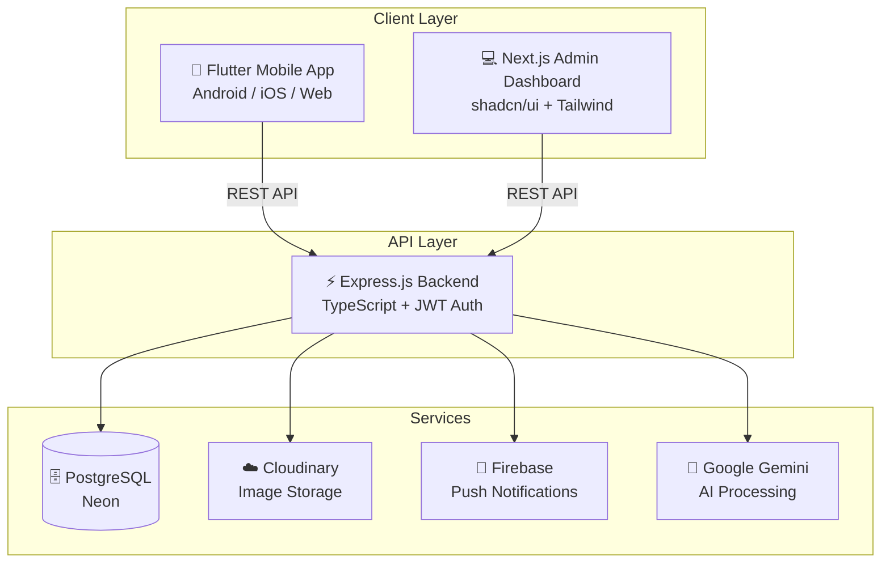

<div align="center">
<h1 align="center">

<br>
MyMatrikulasi
</h1>
<h3 align="center">📍 Empowering Malaysian Matriculation Students to Excel</h3>
<h3 align="center">⚙️ Developed with the software and tools below:</h3>

<p align="center">


</p>

<p align="center">


</p>
</div>

---

## 📚 Table of Contents
- [📚 Table of Contents](#-table-of-contents)
- [📍 Overview](#-overview)
- [💫 Features](#-features)
- [🏗️ Architecture](#️-architecture)
- [📂 Project Structure](#-project-structure)
- [🧩 Modules](#-modules)
  - [Backend (Node.js + TypeScript)](#backend-nodejs--typescript)
  - [Frontend (Flutter)](#frontend-flutter)
  - [Admin Dashboard (Next.js)](#admin-dashboard-nextjs)
- [🚀 Getting Started](#-getting-started)
  - [✅ Prerequisites](#-prerequisites)
  - [🖥 Installation](#-installation)
  - [🤖 Running the Application](#-running-the-application)
  - [🧪 Running Tests](#-running-tests)
- [🗺 Roadmap](#-roadmap)
- [🤝 Contributing](#-contributing)
- [📄 License](#-license)
- [👏 Acknowledgments](#-acknowledgments)

---

## 📍 Overview

**MyMatrik** is a comprehensive student productivity platform designed specifically for **Malaysian Matriculation students**. The application helps students manage their academic schedules, track assignments, visualize study load stress, and stay connected with campus events.

The project follows a modern **client-server architecture** with three main components:
- 📱 **Mobile App** - Cross-platform Flutter application for students
- 💻 **Admin Dashboard** - Next.js web application for administrators
- ⚡ **Backend API** - RESTful API built with Express.js and TypeScript

---

## 💫 Features

| Feature | Description |
|---|---|
| **🔐 Authentication System** | Secure JWT-based authentication with role-based access control. Supports student registration with matriculation number validation and admin authentication. |
| **📅 Dynamic Timetable** | Interactive timetable display with real-time hero visualization, prioritizing upcoming classes with detailed information including lecturer names and venues. |
| **📊 Study Load Meter** | Visual stress indicator that calculates an academic pressure score based on pending assignments, providing students immediate awareness of their workload. |
| **📋 Assignment Tracker** | Comprehensive task management with priority levels, due date pickers, and completion status tracking to improve time management. |
| **🎉 Campus Events Hub** | View and post college-specific events with image support, including community "Interest" tracking for event engagement. |
| **🔔 Push Notifications** | Firebase-powered targeted alerts for upcoming classes, announcements, and system updates. |
| **🎨 Theme Support** | Full Dark and Light mode support with high-contrast optimization for enhanced timetable visibility. |
| **🤖 AI-Powered Import** | Smart timetable import pipeline using Google Gemini AI for automatic data extraction from uploaded PDF schedules. |
| **📈 Admin Analytics** | Real-time dashboards with charts for user distribution, stress levels analysis, and active user metrics. |
| **🖼️ Profile Customization** | Nickname system and profile picture support with Cloudinary integration for image storage and moderation queue. |

---

## 🏗️ Architecture



---


## 📂 Project Structure

```bash
MyMatrik/
├── backend/                     # Node.js Backend API
│   ├── prisma/
│   │   ├── schema.prisma        # Database schema definition
│   │   ├── migrations/          # Database migrations
│   │   └── seed.ts              # Database seeding scripts
│   ├── src/
│   │   ├── app.ts               # Main Express application (2000+ lines)
│   │   ├── server.ts            # Server entry point
│   │   ├── middleware/          # Auth, rate limiting, audit logging
│   │   ├── schemas/             # Zod validation schemas
│   │   └── services/            # External services (Gemini AI, Firebase)
│   ├── test/                    # Jest test suites
│   └── package.json
│
├── frontend/                    # Flutter Mobile Application
│   ├── lib/
│   │   ├── main.dart            # App entry point with theme configuration
│   │   ├── models/              # Data models (User, Assignment, Event, etc.)
│   │   ├── providers/           # State management with Provider
│   │   ├── screens/             # UI screens
│   │   │   ├── home_screen.dart
│   │   │   ├── login_screen.dart
│   │   │   ├── timetable_screen.dart
│   │   │   ├── assignment_screen.dart
│   │   │   ├── events_screen.dart
│   │   │   ├── settings_screen.dart
│   │   │   └── onboarding/      # Multi-step registration flow
│   │   ├── services/            # API service layer with Dio
│   │   ├── utils/               # Helper utilities
│   │   └── widgets/             # Reusable UI components
│   ├── test/                    # Widget & unit tests
│   └── pubspec.yaml
│
├── admin-dashboard/             # Next.js Admin Console
│   ├── src/
│   │   ├── app/
│   │   │   ├── (dashboard)/     # Protected dashboard routes
│   │   │   │   ├── academic/    # CRUD for Colleges, Streams, Modules
│   │   │   │   ├── analytics/   # System analytics & charts
│   │   │   │   ├── timetables/  # AI-powered timetable import
│   │   │   │   ├── moderation/  # Content approval queue
│   │   │   │   ├── students/    # Student management
│   │   │   │   ├── events/      # Event management
│   │   │   │   ├── global-assignments/ # System-wide assignments
│   │   │   │   └── audit-logs/  # Activity logging
│   │   │   └── login/           # Admin authentication
│   │   ├── components/          # shadcn/ui components
│   │   ├── hooks/               # Custom React hooks
│   │   ├── lib/                 # Utilities and API helpers
│   │   ├── types/               # TypeScript type definitions
│   │   └── workers/             # PDF processing web workers
│   └── package.json
│
└── conductor/                   # Project Documentation
    ├── product.md               # Product requirements
    └── tech-stack.md            # Technology decisions
```

---


## 🧩 Modules

### Backend (Node.js + TypeScript)

<details closed><summary>Core Application</summary>

| File | Summary |
|:-----|:--------|
| `src/app.ts` | Main Express application containing all API routes including authentication, discovery cascading API, user management, assignment tracking, event handling, timetable operations, and admin CRUD operations. Implements comprehensive middleware stack. |
| `src/server.ts` | Server entry point that bootstraps the Express application and starts the HTTP server. |

</details>

<details><summary>Middleware</summary>

| File | Summary |
|:-----|:--------|
| `middleware/auth.ts` | JWT authentication middleware that validates tokens and attaches user context to requests. |
| `middleware/adminAuth.ts` | Admin-specific authentication with role-based authorization (ADMIN, SUPER_ADMIN). |
| `middleware/rateLimit.ts` | Rate limiting configuration for auth endpoints and global API requests. |
| `middleware/validate.ts` | Zod schema validation middleware for request body/query validation. |
| `middleware/auditLog.ts` | Activity logging middleware for tracking admin actions. |

</details>

<details><summary>Services</summary>

| File | Summary |
|:-----|:--------|
| `services/gemini.ts` | Google Generative AI integration for parsing timetable PDFs using Gemini 1.5 Flash model with structured JSON output. |
| `services/firebase.ts` | Firebase Admin SDK configuration for push notification delivery to student devices. |
| `services/cloudinary.ts` | Cloudinary configuration for profile picture uploads and image transformations. |

</details>

<details><summary>Schemas</summary>

| File | Summary |
|:-----|:--------|
| `schemas/auth.schema.ts` | Validation schemas for user registration and login with password strength requirements. |
| `schemas/academic.schema.ts` | CRUD validation for colleges, streams, modules, lecturers, venues, and course groups. |
| `schemas/assignment.schema.ts` | Assignment creation and update validation with priority levels. |
| `schemas/event.schema.ts` | Event creation validation including image URLs and engagement handling. |
| `schemas/global_assignment.schema.ts` | System-wide assignment creation by administrators. |

</details>

<details><summary>Database</summary>

| File | Summary |
|:-----|:--------|
| `prisma/schema.prisma` | Complete database schema defining User, College, Stream, Module, CourseGroup, TimetableSlot, Assignment, Event, and Admin models with relationships. |
| `prisma/seed.ts` | Database seeding script for initial data population including sample colleges and course structures. |

</details>

---

### Frontend (Flutter)

<details closed><summary>Screens</summary>

| File | Summary |
|:-----|:--------|
| `screens/splash_screen.dart` | Animated splash screen with authentication state detection and automatic navigation routing. |
| `screens/login_screen.dart` | Student login form with validation, error handling, and secure credential storage. |
| `screens/onboarding/` | Multi-step registration wizard with college, stream, and module selection using cascading API. |
| `screens/home_screen.dart` | Main dashboard featuring Study Load Meter, upcoming class hero card, and quick navigation. |
| `screens/timetable_screen.dart` | Interactive weekly timetable view with daily/weekly toggle and class details modal. |
| `screens/assignment_screen.dart` | Assignment list with filtering, sorting by priority/deadline, and completion toggling. |
| `screens/events_screen.dart` | Campus events feed with image galleries, interest tracking, and event posting for students. |
| `screens/settings_screen.dart` | User profile management, theme switching, password change, and logout functionality. |
| `screens/main_navigation.dart` | Bottom navigation controller managing screen switching and maintaining state. |

</details>

<details><summary>Providers</summary>

| File | Summary |
|:-----|:--------|
| `providers/app_state.dart` | Global state management using Provider pattern. Manages authentication state, user data, theme preferences, and calculated study load score. |

</details>

<details><summary>Services</summary>

| File | Summary |
|:-----|:--------|
| `services/api_service.dart` | Centralized API client using Dio with request/response interceptors, token injection, and error handling. |
| `services/auth_service.dart` | Authentication operations including login, registration, token refresh, and secure storage. |
| `services/notification_service.dart` | Firebase Cloud Messaging setup for receiving and handling push notifications. |

</details>

<details><summary>Models</summary>

| File | Summary |
|:-----|:--------|
| `models/user.dart` | User model with course group relationships and JSON serialization. |
| `models/assignment.dart` | Assignment model with priority enum, due date handling, and completion status. |
| `models/event.dart` | Event model with image support and interest count tracking. |
| `models/timetable_slot.dart` | Timetable entry with day, time, venue, subject, and lecturer information. |

</details>

<details><summary>Widgets</summary>

| File | Summary |
|:-----|:--------|
| `widgets/study_load_meter.dart` | Animated circular progress indicator showing calculated stress score with color gradients. |
| `widgets/class_card.dart` | Reusable component displaying class information with venue and time. |
| `widgets/assignment_tile.dart` | List tile for assignments with priority indicator and completion checkbox. |
| `widgets/event_card.dart` | Card component for events with image preview and interest button. |

</details>

---

### Admin Dashboard (Next.js)

<details closed><summary>Dashboard Pages</summary>

| Route | Summary |
|:------|:--------|
| `app/(dashboard)/page.tsx` | Main dashboard with key metrics overview, recent activity, and quick action buttons. |
| `app/(dashboard)/academic/` | Academic structure management with CRUD for Colleges, Streams, Modules, Lecturers, and Venues. |
| `app/(dashboard)/timetables/` | AI-powered timetable import featuring PDF upload, class detection preview, and batch persistence. |
| `app/(dashboard)/moderation/` | Content approval queue for student profile pictures and event images with approve/reject actions. |
| `app/(dashboard)/analytics/` | System analytics with Recharts visualizations for user distribution, stress levels, and activity trends. |
| `app/(dashboard)/students/` | Student management with search, filtering by college/stream, and detailed user profiles. |
| `app/(dashboard)/events/` | Event management with moderation controls and visibility settings. |
| `app/(dashboard)/global-assignments/` | Administrator-created assignments pushed to all students matching criteria. |
| `app/(dashboard)/course-groups/` | Course group configuration linking streams, modules, and class sections. |
| `app/(dashboard)/audit-logs/` | Activity log viewer for tracking administrative actions with filtering. |
| `app/(dashboard)/system/` | System configuration and maintenance utilities. |
| `app/(dashboard)/announcements/` | Push notification composer for broadcasting messages to student segments. |

</details>

<details><summary>Components</summary>

| Directory | Summary |
|:----------|:--------|
| `components/ui/` | shadcn/ui component library including Button, Dialog, Select, Tabs, Avatar, and more. |
| `components/forms/` | Form components with react-hook-form integration and Zod validation. |
| `components/tables/` | Data table components with sorting, filtering, and pagination. |
| `components/charts/` | Recharts wrapper components for analytics visualizations. |

</details>

<details><summary>Workers</summary>

| File | Summary |
|:-----|:--------|
| `workers/pdf-scanner.worker.ts` | Web Worker using pdfjs-dist for client-side PDF scanning to detect class boundaries before AI processing. |
| `workers/pdf-slicer.worker.ts` | Web Worker using pdf-lib for splitting large PDF timetables into individual pages for parallel processing. |

</details>

---

## 🚀 Getting Started

### ✅ Prerequisites

Before you begin, ensure that you have the following installed:
> - **Node.js** (v18 or higher) & npm
> - **Flutter SDK** (3.0.0 or higher)
> - **PostgreSQL** database (or Neon connection string)
> - **Git** for version control

### 🖥 Installation

**1. Clone the repository:**
```sh
https://github.com/hmdnnrmn/mym-backend.git
https://github.com/hmdnnrmn/mym-frontend.git
https://github.com/hmdnnrmn/mym-dashboard.git
```

**2. Backend Setup:**
```sh
cd mym-backend

# Install dependencies
npm install

# Configure environment variables
cp .env.example .env
# Edit .env with your database URL, JWT secret, Cloudinary, and Firebase credentials

# Run database migrations
npx prisma migrate dev

# Seed initial data (optional)
npx prisma db seed
```

**3. Frontend Setup:**
```sh
cd mym-frontend

# Install Flutter dependencies
flutter pub get

# Configure API endpoint
# Edit lib/services/api_service.dart with your backend URL
```

**4. Admin Dashboard Setup:**
```sh
cd mym-dashboard

# Install dependencies
npm install

# Configure environment variables
cp .env.example .env.local
# Edit .env.local with your backend API URL
```

### 🤖 Running the Application

**Backend API:**
```sh
cd mym-backend
npm run dev
# Server runs on http://localhost:3000
```

**Flutter Mobile App:**
```sh
cd mym-frontend
flutter run
# Select your target device/emulator
```

**Admin Dashboard:**
```sh
cd mym-dashboard
npm run dev
# Dashboard runs on http://localhost:3001
```

### 🧪 Running Tests

**Backend Tests:**
```sh
cd mym-backend
npm test
```

**Frontend Tests:**
```sh
cd mym-frontend
flutter test
```

**Admin Dashboard Tests:**
```sh
cd mym-dashboard
npm test
```

---

## 🗺 Roadmap

> - [x] **Core Authentication** - JWT-based auth for students and admins
> - [x] **Timetable Management** - Dynamic timetable display with venue/lecturer info
> - [x] **Assignment Tracking** - Priority-based task management
> - [x] **Study Load Meter** - Visual stress indicator
> - [x] **Campus Events** - Event posting and interest tracking
> - [x] **AI Timetable Import** - Gemini-powered PDF extraction
> - [x] **Push Notifications** - Firebase FCM integration
> - [x] **Admin Dashboard** - Full management console
> - [ ] **Offline Mode** - Local data caching for mobile app
> - [ ] **Study Groups** - Collaborative features for students
> - [ ] **Academic Calendar** - Semester-wide event planning
> - [ ] **Grade Tracking** - Academic performance monitoring

---

## 🤝 Contributing

Contributions are always welcome! Please follow these steps:

1. **Fork** the project repository. This creates a copy of the project on your account that you can modify without affecting the original project.

2. **Clone** the forked repository to your local machine:
```sh
https://github.com/hmdnnrmn/mym-backend.git
https://github.com/hmdnnrmn/mym-frontend.git
https://github.com/hmdnnrmn/mym-dashboard.git
```

3. **Create a new branch** with a descriptive name:
```sh
git checkout -b feature/amazing-feature
```

4. **Make changes** to the project's codebase.

5. **Commit** your changes with a clear commit message:
```sh
git commit -m 'Add amazing feature'
```

6. **Push** your changes to your forked repository:
```sh
git push origin feature/amazing-feature
```

7. **Create a Pull Request** to the original repository. Describe the changes you've made and why they're necessary.

---

## 📄 License

This project is licensed under the **MIT** License. See the [LICENSE](LICENSE) file for additional information.

---

## 👏 Acknowledgments

> - **Malaysian Matriculation Division** - For inspiring the academic structure design
> - **Flutter & Dart Team** - For the excellent cross-platform framework
> - **Vercel** - For seamless backend deployment
> - **Neon** - For serverless PostgreSQL hosting
> - **shadcn/ui** - For beautiful, accessible React components
> - **Google Gemini AI** - For intelligent PDF parsing capabilities

---

<div align="center">
<p>Made with ❤️ for Malaysian Matriculation Students</p>
</div>
